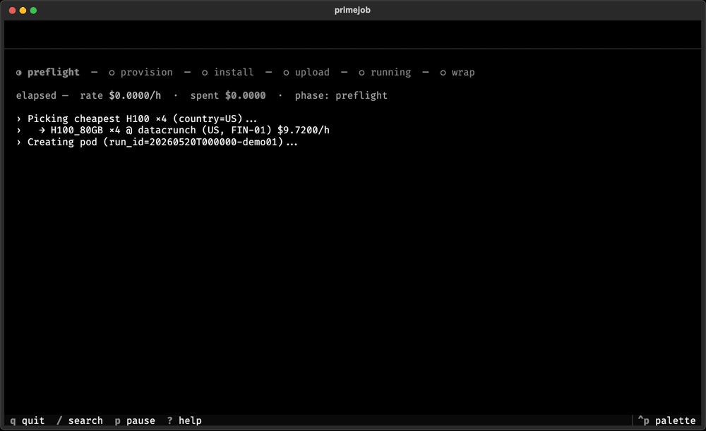

# primejob



CLI for running GPU training jobs on Prime Intellect. A dev who today does `uv run train.py` locally should do `primejob run train.py --gpu H100` instead — and get the same UX, but the training runs on a remote GPU pod with reusable dataset storage.

## Install

Install from GitHub (PyPI publish is not available yet):

```bash
uv add git+https://github.com/AleksanderObuchowski/primejob.git
primejob doctor   # verify auth, SSH key, paramiko, SDK, prime CLI
```

### First run

1. **`primejob login`** — Runs **`prime login`** when credentials are missing, picks a working key under `~/.ssh/` (`id_ed25519`, then `id_rsa`, then `id_ecdsa`), saves `ssh_key_path` in Prime CLI config, uploads the public key to your Prime account via the API when needed, optionally promotes it to primary, then runs **`primejob doctor`**. Flags: **`--yes`** / **`-y`** for non-interactive defaults; **`--smoke-test`** provisions the cheapest CPU pod, waits for SSH, and terminates it (small cost) to validate end-to-end access.

2. **`primejob doctor`** — Repeat anytime to verify auth, SSH registration, and **primary** key status (pods receive the primary key).

3. **`primejob run …`** — Start remote jobs (see Quickstart).

Provisioning waits until the pod is running, exposes an SSH endpoint, and (when the API reports it) **`installation_progress` reaches 100%** — so the first connection is less likely to hit half-ready VMs.

Right after the pod is reachable, **`primejob run`** and **`primejob login --smoke-test`** pause briefly before the first SSH attempt so `sshd` and `authorized_keys` propagation can settle.

Use **`primejob run --setup-ssh`** to auto-configure your SSH key and register it with Prime before provisioning (non-interactive).

### SSH troubleshooting

Prime pods receive your account's **primary** SSH public key — registration alone is not always enough. **`primejob doctor`** reports whether your local key is registered and marked primary (pod injection). **`primejob run`** (and smoke tests) send your registered key's **`sshKeyId`** in the pod create payload so Prime injects it promptly on slow providers.

Some providers expose SSH while **`authorized_keys` is still empty** or never populated by Prime's backend. If you see repeated **`SSH [auth_propagation]`** retries for more than about a minute, it is usually **not** a local config issue — Prime may not have injected your registered primary key into that provider's VM.

**Workarounds:**

- Confirm primary status: **`primejob doctor`** or **`primejob login --yes`**
- Exclude broken providers: **`primejob run --skip-provider massedcompute --skip-provider nebius`**
- Persistent project config:

```toml
[tool.primejob]
exclude_providers = ["massedcompute", "nebius", "crusoecloud"]
```

- Try a different **`--country`** to land on another provider
- Use **`primejob run --setup-ssh`** before provisioning to register and promote your key non-interactively

Tune SSH retry budgets in **`pyproject.toml`** (defaults shown):

```toml
[tool.primejob]
ssh_max_wait = 300      # seconds (default 300)
ssh_retry_delay = 5     # seconds between attempts (default 5)
```

When published, `uv add primejob` will work from PyPI.

`PRIME_API_KEY` is read from `.env` in cwd or from `~/.prime/config.json` (after `prime login` / `primejob login`).

## Configure

Add to your project's `pyproject.toml`:

```toml
[tool.primejob]
dataset_disk = "my-project-data"     # persistent disk reused across runs
forward_env  = ["HF_TOKEN", "WANDB_API_KEY"]
default_gpu  = "H200"                # short alias — resolved to H200_141GB
default_country = "US"               # optional; biases pod placement
default_disk_size = 50               # GB, used when creating the disk fresh
include      = ["data/train.jsonl", "configs/*.yaml"]  # extra files to ship (see Packaging)
ssh_max_wait = 300                   # optional; SSH connect budget (seconds)
ssh_retry_delay = 5                  # optional; delay between SSH retries (seconds)
exclude_providers = ["massedcompute"]  # optional; skip providers when picking cheapest GPU
```

`bundle_paths` from older configs is still accepted as an alias for `include`; the first run prints a one-time rename hint and the values are merged in.

## Quickstart

```bash
# 1. Push a dataset once — reused by every later run on this disk.
primejob dataset push ./data

# 2. List what's on it.
primejob dataset list

# 3. Run training. Auto-picks cheapest matching GPU, uploads src
#    (respects .gitignore), runs `uv sync` + `uv run python train.py`,
#    streams output, downloads outputs/ when done, terminates pod.
#    Opens a Textual dashboard in a TTY; falls back to plain streaming
#    in CI / pipes. Pass --plain to force plain mode.
primejob run train.py --gpu H100 --yes

# 4. Inspect later.
primejob runs list
primejob status <run_id>
primejob logs   <run_id>
primejob attach <run_id>      # re-open dashboard (view-only)
primejob terminate <run_id>   # safety net if a run wedged
primejob runs list --check-remote   # flag runs that may still be billing
primejob runs reconcile             # detect stale local "running" manifests
primejob runs reconcile --terminate-stale   # stop billing on stale pods
```

### Pod lifecycle safety

`primejob run` owns the pod for the lifetime of the command. A detached local **watchdog** terminates the pod if the foreground process dies (`kill -9`, terminal closed, parent harness exit) while the machine is still up.

- **Graceful exit** (`Ctrl+C`, errors, normal finish): cleanup terminates the pod and finalizes `~/.primejob/runs/<run_id>/manifest.json`.
- **Abrupt local death**: the watchdog detects a dead parent PID or stale lease heartbeat and terminates the pod.
- **Recovery**: `primejob runs list --check-remote`, `primejob runs reconcile`, and `primejob terminate <run_id>` surface and fix stale `running` manifests.

**Manual repro (kill -9):**

```bash
primejob run train.py --gpu <small_gpu> --yes --plain
# After "SSH connected" / pod_id is in manifest:
kill -9 <primejob_pid>
# Within ~5s the watchdog should terminate the pod; manifest status → terminated.
prime pods list
primejob status <run_id>
```

A host crash or OOM that kills both the CLI and watchdog cannot be covered locally; use `primejob runs reconcile` when you return.

### Dashboard keybindings (TTY mode)

`q` quit · `^C` terminate run (with confirm) · `/` search log · `p` pause auto-scroll · `?` help with the rest (`e` edit log in $EDITOR, `o` open outputs, `t` cycle theme, `g` toggle GPU panel, `s` show pod_id, `k` show run_id).

## Examples

Complete example projects live under `examples/`:

- `examples/hf-sentiment-json` — Hugging Face `Trainer` sentiment classification from `data/train.json`.
- `examples/image-folder-torch` — Torch image-folder classification from `data/image_folder/<class>/*.ppm`.
- `examples/unsloth-sft` — Unsloth + TRL SFT on a tiny in-memory instruction dataset.

Each example has its own `pyproject.toml`, `.python-version`, `uv.lock`, training script, and README.

Anything after the script name is forwarded to your script:

```bash
primejob run train.py --gpu H100 -- --epochs 10 --lr 3e-4
```

## Dataset modes

`primejob run` has four dataset modes:

```bash
# Default: attach the persistent disk to the training pod.
primejob run train.py --disk my-project-data --data-mode attach

# Copy/stage mode: use the persistent disk only briefly, then run without it.
primejob run train.py --disk my-project-data --data-mode stage

# No persistent disk — for providers/regions where disk create fails, or HF Hub-only jobs.
primejob run train.py --gpu H100 --data-mode none --yes

# Bundle local data into the src tarball (even if gitignored).
primejob run train.py --gpu H100 --data-mode local --include-data data/train.jsonl --yes
```

`attach` is fastest for one job: Prime mounts the persistent disk directly and `PRIMEJOB_DATASET_PATH` points at that mount. The disk must be compatible with the selected provider/location, and Prime currently treats it as an exclusive attachment: concurrent runs on the same disk can fail with `Disk ... is already used`. primejob filters GPU availability by `disks=[disk_id]` in this mode and waits for the disk to detach after termination before finishing the run.

`stage` is for parallel experiments on the same dataset. primejob starts a short-lived helper pod, downloads the dataset from the persistent disk to `.primejob/staged/<run_id>/`, starts the actual training pod without attaching the disk, uploads the staged dataset to `/tmp/primejob/dataset`, and sets `PRIMEJOB_DATASET_PATH=/tmp/primejob/dataset`. This avoids holding the persistent disk during training, so other jobs can use the same source disk. The tradeoff is extra transfer time and local temporary storage. For large disks, pass `--data-subdir NAME` to stage only the needed subdirectory.

`none` skips persistent disks entirely — ignores `[tool.primejob].dataset_disk` and does not set `PRIMEJOB_DATASET_PATH`. Use this on providers where disk create returns errors (e.g. some Nebius / Crusoe regions) or when your script loads data from Hugging Face Hub.

`local` bundles paths from `--include-data` and/or `[tool.primejob].include` into the uploaded src tarball, even when those paths are gitignored. The same patterns are used for the broader **Packaging** flow below — `--data-mode local` just additionally exposes them through `PRIMEJOB_DATASET_PATH`, which points at the first bundled directory under `/tmp/primejob/work/`.

## Packaging

primejob figures out what to ship to the pod by reading your entrypoint, not by uploading the entire working directory. Each `primejob run` (and `primejob package`) builds a `PackagePlan` from three sources:

1. **AST import closure.** Static analysis of `train.py` walks every local `import`, follows them recursively, and adds the files behind them. Third-party packages and the stdlib are skipped (they come from `uv sync` on the pod). Both flat layouts (`src/data.py`) and src-layouts (`src/<pkg>/...`) work without extra config.
2. **Always-include manifest.** `pyproject.toml`, `uv.lock`, `.python-version`, and top-level `README*` / `LICENSE*` files are added if present so `uv sync` has what it needs.
3. **Explicit `include` patterns.** Anything matching `[tool.primejob].include` (or `--include`/`--include-data` on the CLI) is added — globs (`configs/*.yaml`), directory shorthand (`data/`), and double-star (`runs/**/manifest.json`) are all supported. This is where data files belong.

A small `DEFAULT_EXCLUDES` safety belt prunes `.git/`, `.venv/`, `.uv-cache/`, `node_modules/`, `__pycache__/`, `outputs/`, `.env`, and similar caches before they ever reach the tarball.

Dynamic imports (`importlib.import_module`, `__import__`) cannot be resolved statically. primejob reports them and, in a TTY, asks once whether to add them to your `include` list; in `--yes` / non-interactive mode they become a warning and the run continues.

If the tarball ends up above 100 MB, primejob prints the five largest files so you can spot the runaway directory and tighten your patterns.

### Previewing what gets shipped

Use the dry-run command to inspect the plan before any pod is created:

```bash
primejob package train.py --dry-run
# Packaging plan for train.py
#   Python imports (AST closure) (3)
#     train.py
#     src/__init__.py
#     src/data.py
#   Always included (2)
#     pyproject.toml
#     uv.lock
#   Explicit include (1)
#     data/train.jsonl
#   Total: 6 files, 0.2 MB (uncompressed)
```

Drop `--dry-run` to write the tarball to disk (`./primejob-package.tar.gz` by default, or `-o path.tar.gz`). Add `--include / -i pattern` to test extra patterns without editing `pyproject.toml`.

## What primejob does for you on each run

1. Walks `pyproject.toml` + `uv.lock`, validates `forward_env`.
2. Calls Prime's availability API and picks the cheapest offering matching `--gpu` / `--count` / `--country`.
3. Asks once for cost confirmation (skip with `--yes`).
4. Creates the persistent disk if missing, in the cheapest region matching country.
5. Handles the dataset according to `--data-mode`: attach the disk directly, or stage a copy first.
6. Builds the src tarball from your entrypoint's AST closure + always-include manifest + `[tool.primejob].include` patterns (see **Packaging**), then uploads via SFTP with progress.
7. Runs `uv sync` then `uv run python <script>` over a streaming SSH channel — stdout/stderr to your terminal AND to `~/.primejob/runs/<run_id>/log.txt`.
8. Background status bar every 30s: `[run_id] elapsed=12m34s rate=$2.43/h spent=$0.51`.
9. On exit (success, failure, or `Ctrl+C`): downloads `outputs/` back to `./outputs/<run_id>/`, terminates the pod, waits for attached disks to detach, writes a run manifest.

The dataset path is exposed to your script as `PRIMEJOB_DATASET_PATH` in both modes.

## GPU type aliases

You can pass either short or full names:

| Short    | Full              |
|----------|-------------------|
| H100     | H100_80GB         |
| H200     | H200_141GB        |
| A100     | A100_80GB         |
| B200     | B200_180GB        |
| RTX4090  | RTX4090_24GB      |
| CPU      | CPU_NODE          |

Full list: `primejob gpus list`.

## Where state lives

- `~/.primejob/runs/<run_id>/manifest.json` — per-run record (gpu, cost, exit code).
- `~/.primejob/runs/<run_id>/log.txt`       — full captured stdout/stderr.
- `./outputs/<run_id>/`                     — files your script wrote under `outputs/`, downloaded after the run.
